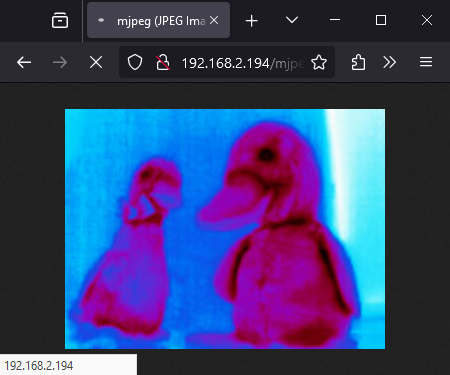
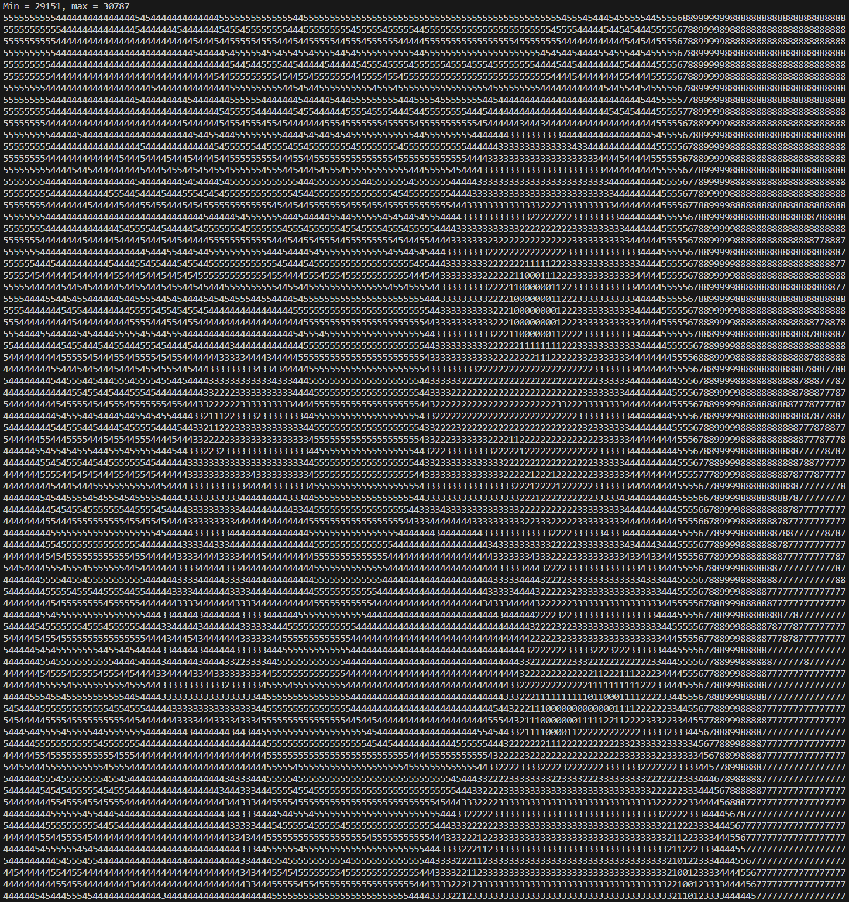

# arduino-lepton
FLIR Lepton drivers for Arduino HAL. Tested with ESP32-S3 + Lepton 3.5 on a custom board, but (in concept) should work on most Arduino platforms that have the enough memory and computational power.


## Examples
All examples should build right out of the box with PlatformIO and have pinmaps defined at the top of main.cpp.

- [ESP32-S3 webserver example](examples/esp32_webserver) with single-frame capture and streaming MJPEG, in greyscale or RGB888 (colorized) mode.
  Uses the [JPEGENC](https://github.com/bitbank2/JPEGENC) library and FreeRTOS (part of all ESP32 builds).
  Likely compatible across the ESP32 family.

  
  
  Lightly refrigerated plush ducks over the webserver example, as viewed from a browser.
- [Serial console example](examples/basic_serial) that prints frames to the console, each pixel being a single character (auto-scaled from 0-9).
  Likely works on any Arduino platform with a serial console, good basic test of functionality with minimal dependencies.

  

  Lightly refrigerated plush ducks over the serial console example.


## Usage
```c++
FlirLepton lepton(i2c, spi, kPinLepCs, kPinLepRst);
uint8_t frameBuffer[160*120*2] = {0};

lepton.begin();  // resets the Lepton
while (!lepton.isReady());  // poll until Lepton reports ready

while (true) {
  bool readResult = lepton.readVoSpi(sizeof(frameBuffer), frameBuffer);  // returns true on a new frame
  if (readResult) {
    // do something with frameBuffer
  }
}
```

See full API in the [header file](include/lepton.h).


## Notes
- VoSPI is a timing-sensitive protocol and desynchronizes if frames are not read out promptly.
  If using an RTOS, the Lepton driver needs to be high priority to ensure SPI is running fast enough.
- In some cases (not quite sure why), the Lepton never returns any valid SPI data and constantly attempts to re-sync without success.
  Power-cycling / resetting the Lepton does not seem to fix the issue, though sometimes random modifications to the firmware might.
  Potentially related to using the VoSPI interface too early (?) or in-between frames (if not using the VSYNC signal). 
- Only tested with Lepton 3.5, but likely works with all Lepton 3 devices (160x120 resolution).
  For other devices, you can try manually setting the video parameters with `FlirLepton::setVideoParameters(uint8_t bytesPerPixel, uint8_t frameWidth, uint8_t frameHeight,
  size_t videoPacketDataLen, size_t packetsPerSegment, size_t segmentsPerFrame)`
- `readVoSpi` blocks when reading a frame, but returns immediately during a discard frame.
  Future versions might look at splitting out the VoSPI into a different class that can have platform-specific optimized implementations, like using DMA and allowing other threads to run while a packet is being read.


## Related Work
These projects do similar things:
- https://github.com/danjulio/tCam: ESP-IDF framework for ESP32E, GPL-3.0 license. Device firmware, not split into a library - though potentially could be done. Potentially needs companion apps to do anything.
- https://github.com/NachtRaveVL/Lepton-FLiR-Arduino: Arduino-based library, MIT license. Appears to be a dead project, last code update Aug 2020. Issues suggest potential issues with ESP32-S3 and Lepton 3.5.
- https://github.com/groupgets/purethermal1-firmware: STM32 using the STM32Cube (?) framework
